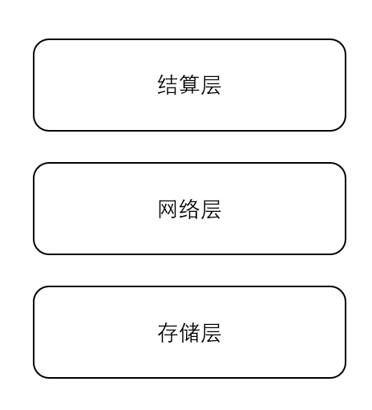

# 简易去中心化存储方案
去中心化存储（Decentralized Storage）不同于分布式存储（Distributed Storage）。分布式存储已经广泛用于 IT 产业，比较出名的有 [CDN](https://en.wikipedia.org/wiki/Content_delivery_network)，[分布式数据库](https://zh.wikipedia.org/zh-cn/%E5%88%86%E5%B8%83%E5%BC%8F%E6%95%B0%E6%8D%AE%E5%BA%93)等，虽然它们的组成部分是分布在不同的地理位置，但是其控制主体仍是某一实体。而去中心化存储将使用无准入机制，因此没有一个实体能控制整个网络。

# 目录
- [简易去中心化存储方案](#%e7%ae%80%e6%98%93%e5%8e%bb%e4%b8%ad%e5%bf%83%e5%8c%96%e5%ad%98%e5%82%a8%e6%96%b9%e6%a1%88)
- [目录](#%e7%9b%ae%e5%bd%95)
- [愿景](#%e6%84%bf%e6%99%af)
- [背景](#%e8%83%8c%e6%99%af)
  - [BitTorrent](#bittorrent)
  - [Swarm](#swarm)
  - [Storj](#storj)
  - [PPIO](#ppio)
  - [IPFS](#ipfs)
  - [Filecoin](#filecoin)
- [架构](#%e6%9e%b6%e6%9e%84)
  - [服务类型](#%e6%9c%8d%e5%8a%a1%e7%b1%bb%e5%9e%8b)
  - [激励系统和共识机制](#%e6%bf%80%e5%8a%b1%e7%b3%bb%e7%bb%9f%e5%92%8c%e5%85%b1%e8%af%86%e6%9c%ba%e5%88%b6)
  - [信誉系统](#%e4%bf%a1%e8%aa%89%e7%b3%bb%e7%bb%9f)

# 愿景
这个去中心化存储网络的的理想中的最终形态将是：
1. 拥有上十亿个节点，每个节点贡献存储空间，并提供数据服务。
2. 手持设备将只是一个显示工具，涉及到存储的数据以及计算都从该去中心化存储网络中得到。

# 背景

## [BitTorrent](https://en.wikipedia.org/wiki/BitTorrent)

## [Swarm](https://ethersphere.github.io/swarm-home/)

## [Storj](https://storj.io/)

## [PPIO](https://www.pp.io/)

## [IPFS](https://ipfs.io/)

## [Filecoin](https://filecoin.io/)

# 架构

## 服务类型

目前的构想是，该基础设施最终形态能提供底层的所有数据服务，主要有以下几类：
1. 文件存储。这个类似 BT
2. 充当服务端。比如提供前端需要的网页。
3. 充当数据库。等等

其实还可以充当计算机，就是分布式计算那一套。但是我的设想里，主要是参与者使用一些旧电脑，旧手机等来提供服务，因此计算能力可能没那么行，而且分布式计算，计算任务的分割之类的可能比较复杂，可以另起一个项目实现。

还有一个动机是手边的旧电脑，旧手机，旧磁盘比较多，相比其他人也是这种情况，要是能够利用起来，对大家都有利。

## 激励系统和共识机制
关于激励系统，个人想法，即使没有激励系统，仅靠用爱发电，这个系统也能够基本运转，类似 BT。当然，如果能够加入激励，能够让这个系统的可用性更高，也能够让该系统规模更大，网络效应更大，服务质量更好。既然有了激励，因此不鼓励做出贡献而不要回报的行为。

关于共识机制，考察了 Filecoin 复杂的白皮书，以及比较高的硬件要求，我产生了一个另外的思路。存储基础设施，它本质是一种服务，当有人需要数据时，“矿工”能够马上把对应数据传递过来，本身这个数据就是一种证明。而且这种证明/服务以及能够满足需求了。我把这种证明叫做服务证明，proof of service，简称 pose。

下面来具体阐述激励系统。
设 Alice 需要下载数据 a，而所有的数据提供者是 Bob。那么该过程结束后，Bob 就拥有对应的系统 Token，Balance[Bob][Alice] = k。某种意义上表示 Bob 拥有对 Alice 的债权，Alice 拥有对 Bob 的债务。其中 k，是根据数据 a 的大小（kB），以及 Alice 和 Bob 事先商量好的"价格"（p/kB）决定。此时如果 Alice 和 Bob 商量好了 k 个币对应的法币数量，并且用法币进行支付后，整个交易行为已经结束。当然，本身一次数据传输产生的价值量是极低的。因此正常情况会大量留存，后续在结算层统一结算。

回顾上面的过程，可能会有几个问题：
1. **否认**：Bob 提供了对应的数据，而 Alice 不承认。数据 a 在传输过程中，数据 a 会分成 n 个数据包，理想情况下 Alice 每 收到一个数据包，就会签名表示她已经收到并发送给 Bob，Bob在接收到上一个数据包之后的确认，再发送下一个数据包，因此，即使 Alice 不承认，Bob 也只是损失某个数据包的服务费。而实际考虑到通信的延迟以及效率之类的，不可能每次都等到 Alice 的签名过来后才发送下一个。这里需要一个信誉系统。
设 Alice 需要下载数据 a，而所有的数据提供者是 Bob。那么该过程结束后，Bob 就拥有对应的系统 Token，Balance[Bob][Alice] = k。某种意义上表示 Bob 拥有对 Alice 的债权，Alice 拥有对 Bob 的债务。其中 k，是根据数据 a 的大小（kB），以及 Alice 和 Bob 事先商量好的"价格"（p/kB）决定。此时如果 Alice 和 Bob 商量好了 k 个币对应的法币数量，并且用法币进行支付后，整个交易行为已经结束。
2. **欺骗**：Bob 提供了对应的数据 a，Alice 接收对应的数据，但是 Bob 谎称收到 b。其中 a != b。本质这是不可能。因为 Balance[Bob][Alice] = k 必须是 Alice 签名才有效。

在默认情况下，双方均使用官方的客户端，则不存在上述问题。

## 信誉系统
账户的来源有两种，一种是使用 GitHub 注册。暂时所有的